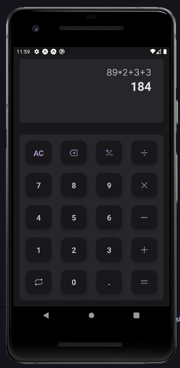

## 🎉 About

**Calc** It's an application for making simple math calculations.
It was developed so I could improve my knowledge of React Native and Native-base

<hr />

## 🔌 Technologies

 <b>TypeScript</b>,
 <b>React Native | Expo</b>,
 <b>Native Base</b>

## 🎨 Layout Preview


## 👨‍💻 Running

<table style="width:100%;">
<tr>
  <td align="center"> <strong>Using Yarn</strong> </td> 
  <td align="center"> <strong>Using npm</strong> </td>
</tr>

<tr>
  <td>

  ```bash
  # Download repo
  $ git clone https://github.com/hemerson-git/my-apps.git
  
  # Install back-end dependencies
  $ cd my-apps-master/calc && yarn

  # Run ReactJS front-end
  $ expo start
  ```
  </td>
<td>


```bash
# Download repo
  $ git clone https://github.com/hemerson-git/my-apps.git

# Install back-end dependecies
$ cd my-apps-master/calc && npm install

# Run ReactJS front-end
$ expo start
```


</td>
</table>
