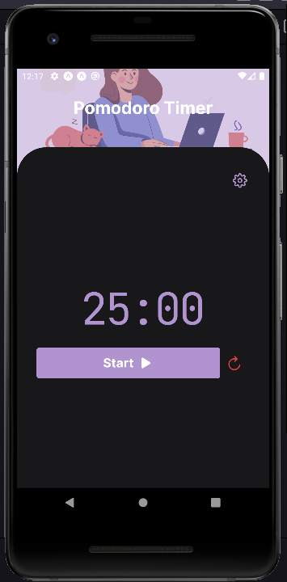
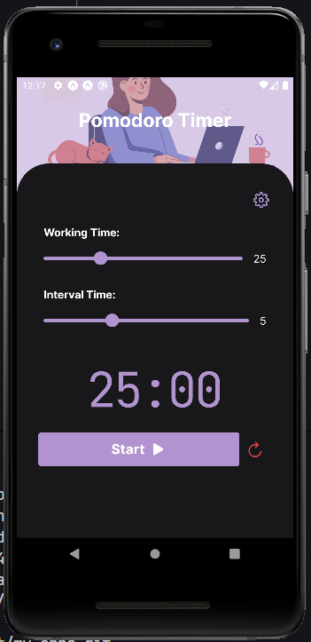

## 🎉 About

**Clock** It's an application made firstly thinking about productivity as We can have a clock and a Pomodoro app in our hands.
I've developed it to improve my knowledge about some technologies such as native-base and notifications on expo.

<hr />

## 🔌 Technologies

 <b>TypeScript</b>,
 <b>React Native | Expo</b>
 <b>Native Base</b>

## 🎨 Layout Preview



## 👨‍💻 Running

<table style="width:100%;">
<tr>
  <td align="center"> <strong>Using Yarn</strong> </td>
  <td align="center"> <strong>Using npm</strong> </td>
</tr>

<tr>
  <td>

  ```bash
  # Download repo
  $ git clone https://github.com/hemerson-git/my-apps.git
  
  # Install back-end dependencies
  $ cd my-apps-master/clock && yarn

  # Run ReactJS front-end
  $ expo start
  ```

  </td>
<td>


```bash
# Download repo
  $ git clone https://github.com/hemerson-git/my-apps.git

# Install back-end dependecies
$ cd my-apps-master/clock && npm install

# Run ReactJS front-end
$ expo start
```

</td>
</table>
